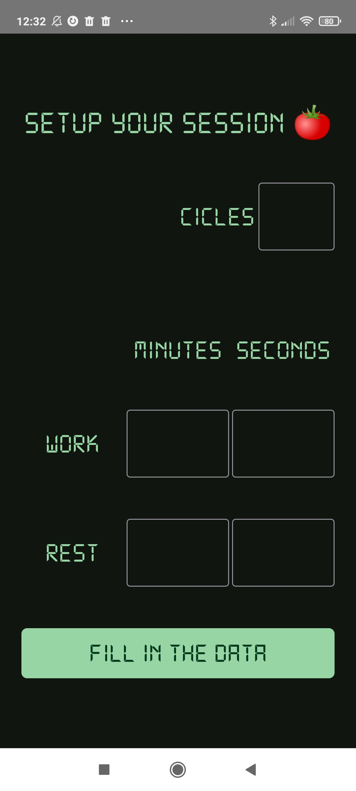
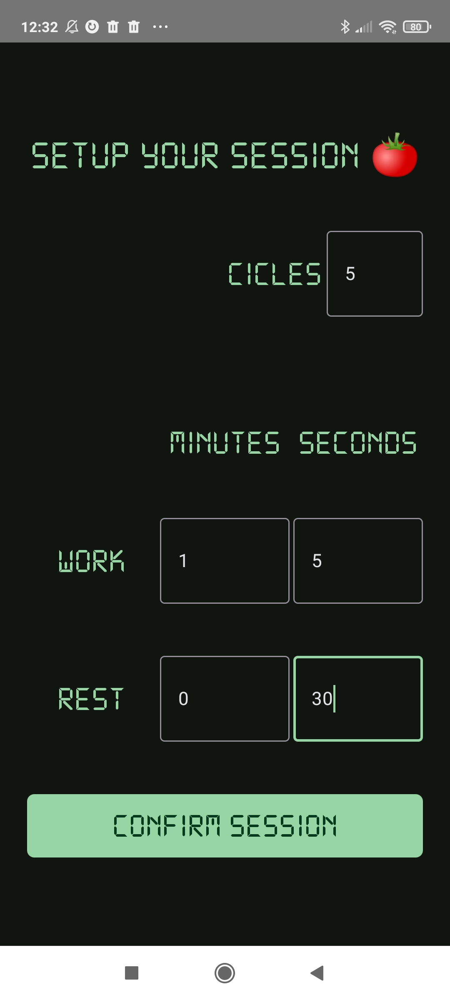
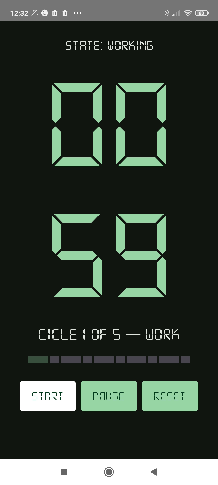
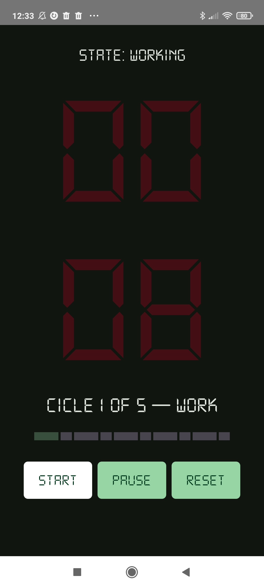
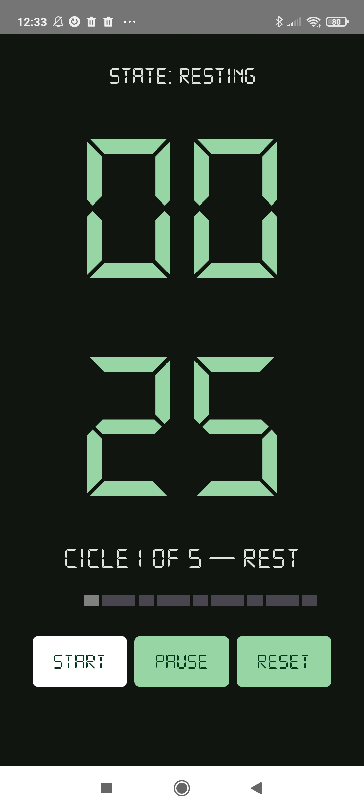

# 🍅 PomodoroJC

**PomodoroJC** es una aplicación móvil de productividad basada en la técnica Pomodoro. Permite configurar sesiones personalizadas de trabajo y descanso, visualizar el progreso por ciclos y controlar el temporizador con una interfaz limpia y responsive.

Este proyecto fue desarrollado como ejercicio para superar una serie de retos técnicos, aplicando Kotlin, Jetpack Compose, corrutinas, arquitectura MVVM y pruebas unitarias con JUnit, con el objetivo de consolidar habilidades en desarrollo de aplicaciones Android modernas.

---

## ✨ Características principales

- Configuración personalizada de número de ciclos, tiempo de trabajo y descanso.
- Temporizador visual con animaciones y parpadeo en tiempo crítico.
- Barra de progreso segmentada por ciclo (trabajo y descanso).
- Validación y normalización automática de los datos ingresados.
- Arquitectura MVVM con Jetpack Compose y StateFlow.
- Pruebas unitarias con **JUnit**.

---

## ✨ Key Features (English)

- Customizable cycles, work time, and rest time.
- Visual timer with animations and blinking in critical time.
- Segmented progress bar for work/rest cycles.
- Real-time validation and automatic normalization of input data.
- MVVM architecture using Jetpack Compose and StateFlow.
- Unit tests with **JUnit**.

---

## 🛠️ Tecnologías utilizadas

- **Lenguaje:** Kotlin  
- **IDE:** Android Studio  
- **UI:** Jetpack Compose + Material 3  
- **Arquitectura:** MVVM + StateFlow  
- **Testing:** JUnit 5

---

## 🖼️ Capturas de pantalla

### Flujo de configuración

| Fill In The Data | Ready | Confirm Session |
|------------------|-------|-----------------|
|  |  |  |


### Ejecución de la sesión Pomodoro

| Start | Cuenta atrás | Descanso |
|-------|--------------|----------|
|  |  |  |

---

## 🚀 Cómo clonar el repositorio  

```bash
git clone https://github.com/eduroman87/pomodoroJC-JetpackCompose-.git

```


  >  📌 Requiere Android Studio 2022 o superior.

---

## **📄 Documentación adicional**

Pruebas unitarias disponibles en la carpeta /test

Diagramas de arquitectura y explicación de lógica del temporizador en preparación.

---

##  ⚖️ Licencia

Este proyecto está disponible bajo la licencia [MIT](LICENSE).

---

## 🙋 Sobre el autor

**Eduardo Román Carrero**  
Desarrollador de aplicaciones multiplataforma  
🔗 [LinkedIn](https://www.linkedin.com/in/eduardoromancarrero)  
🐙 [GitHub](https://github.com/eduroman87)


